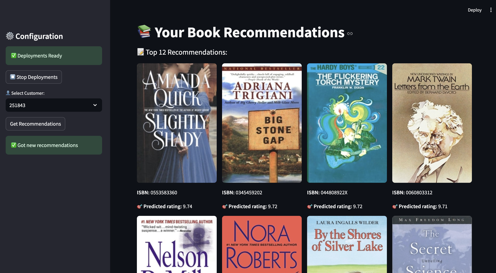

# recommender
> This is a simple project to learn about deployment and serving in an ML system, and how a feature store can be a central hub for connecting the feature, training, and inference pipelines.

Here we apply the machine learning (ML) system to build a book recommender, with a UI mimicking an online web store. We use the two-tower architecture--using tensorflow recommenders for the candidate and user models and catboost for the ranking model. 

Tuning a good recommendation model, however, is **not** the focus of the project. We do not evaluate and optimize any metrics for recommendation systems--a model that outpus a recommendation is considered good enough. Rather, this project focuses on the *system design* of an end-to-end ML product.

As previously mentioned, this ML system consists of _3_ major pipelines: 
1. Feature Pipeline
2. Training Pipeline
3. Inference Pipeline

All of the above integrate and interact with each other through a central _Feature Store_.

### Running the Recommendation System
- make a `.env` file by duplicating `.env.example` and add your Hopsworks API key there. 
- `make install` 
    - to setup the environment and required libraries using ***uv*** package manager
- `make get-data` 
    - to download the dataset
- run the notebooks:
    - 1_feature.ipynb, 
    - 2_training.ipynb, 
    - 3_inference.ipynb
- `make start-ui`

### Inspirations
The project is inspired by:
- Building ML Systems with a Feature Store, Jim Dowling, O'Reilly Media, (2025)
- https://github.com/decodingml/personalized-recommender-course
